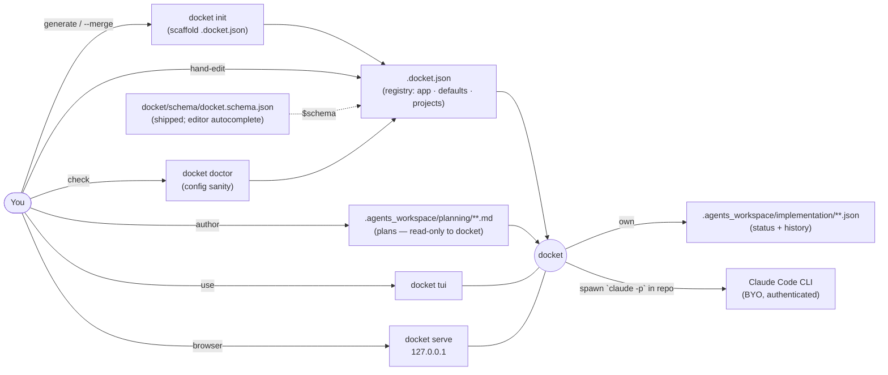
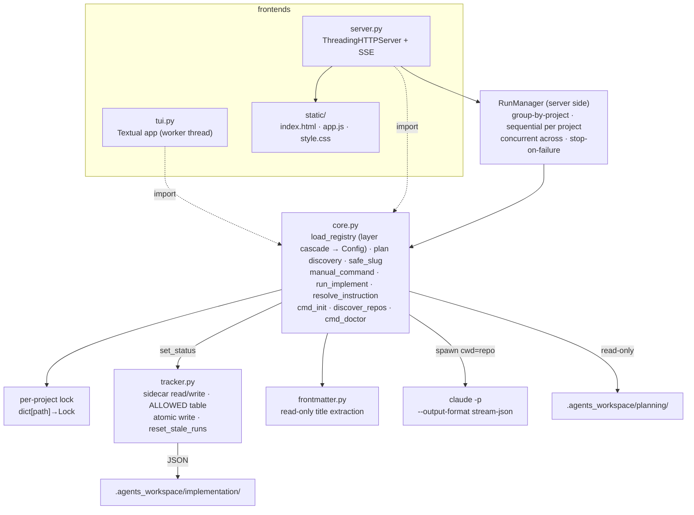
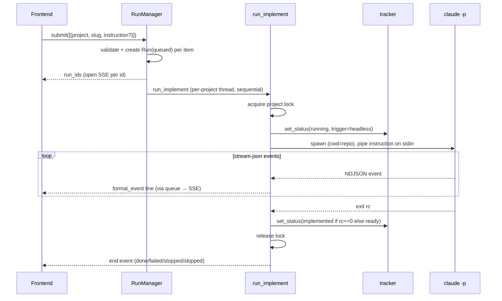
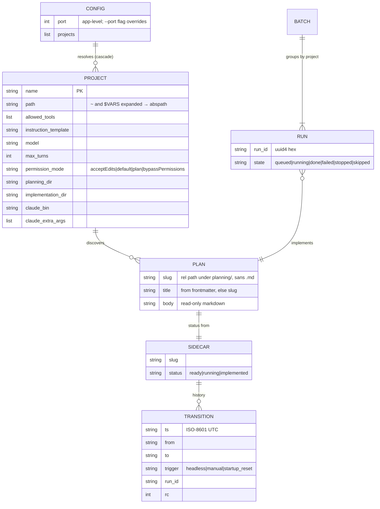
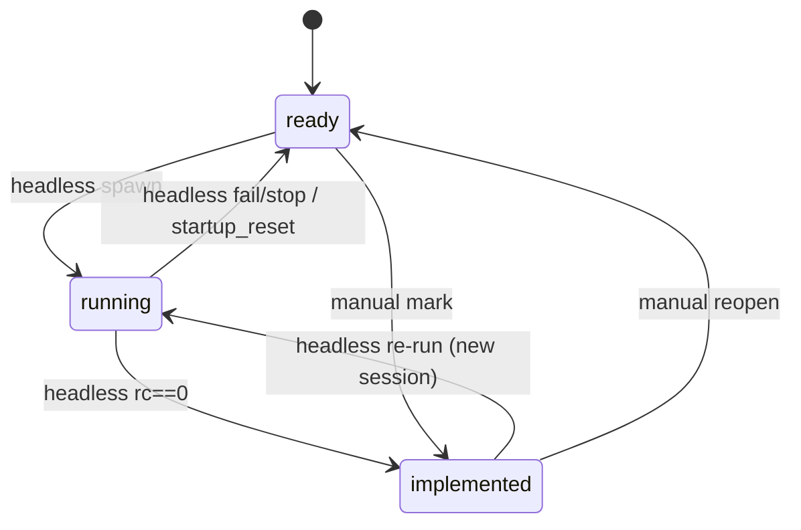

# docket — Architecture

A local command-center over many Claude Code repos: read plans from each repo's
`.agents_workspace/planning/`, track each plan's lifecycle in a JSON sidecar, and implement
plans (manually or headless via `claude -p`) from a Textual TUI or a localhost browser page.

## System context

External actors and systems around docket's boundary.

## Components

Two thin frontends over one shared core + tracker; the only subprocess is the headless runner.

## Key flow — headless implement

The one subprocess path: instruction (naming the plan file) is piped on stdin; the plan body is
never piped — Claude Code opens the file itself.

## Data model

Persisted: Project (registry) and Sidecar (docket-owned). In-memory only: Run and Batch. Plan is
a read-only view of a markdown file plus its sidecar status.

## Lifecycle state machine

Status lives only in the sidecar; the tracker rejects any edge not drawn here.

## Key Decisions

### 2026-06-20 — Three-layer config in .docket.json, resolved at load (v2)

**Status:** Accepted
**Context:** v1 hardcoded most knobs (allowed_tools, model, max_turns, permission mode, the
planning/implementation dirs, the claude binary) and read a flat `projects.json`. Managing ~10
repos needs per-project overrides without per-repo code, and the registry should be the whole
config.
**Decision:** Rename the registry to `.docket.json` and give it three tiers — top-level app
settings (`port`), a `defaults` layer, and `projects[]` overrides. `load_registry` merges them
per-knob (`CODE_DEFAULTS` → `defaults.<k>` → `project.<k>`) into resolved `Project` fields and
returns a `Config`; every downstream reader stays unchanged in shape. The loader is **not**
cached so a changed `--registry`/`$DOCKET_REGISTRY` is always re-read. No automatic migration
from `projects.json` (a top-level `instruction_template` is leniently promoted into `defaults`).
The instruction template keeps a 4th, highest layer: the per-plan override at submit time.
**Consequences:** Every knob is configurable with a global baseline and per-project overrides;
list overrides replace (not merge). `run_implement` preflights `claude_bin` before flipping
status/taking the lock so a bad binary fails cleanly.

### 2026-06-20 — `docket init` scaffolds config; JSON Schema is editor-side only (v2)

**Status:** Accepted
**Context:** A complete `.docket.json` is tedious to hand-author and easy to mistype. Runtime
JSON-Schema validation would add a dependency against the "stdlib-only" decision below.
**Decision:** Ship `docket init [--scan ROOT] [--force|--merge] [--dry-run]` to generate a full
default config (or `--merge` only newly-discovered repos in place, the re-run path as repos
drift) and `docket doctor` to sanity-check it (paths, dupes, planning dir, `permission_mode`,
`claude_bin` on PATH). Ship a JSON Schema (`docket/schema/docket.schema.json`) as package data,
pointed at by the generated `$schema` — consumed by editors only. Runtime loading stays lenient
stdlib checks and never reads the schema.
**Consequences:** No blank-page authoring and no new dependency; `doctor`'s exit code (1 on any
error-level finding) makes it usable as a pre-run gate. The `$schema` pointer is machine-specific
when written absolute by `init` — rerun `init` if the install moves.

### 2026-06-20 — Stdlib http.server + JSON, no web framework or DB

**Status:** Accepted
**Context:** A local single-user tool over ~10 repos. Options: FastAPI/Flask + a database, or
pure stdlib. The data is tiny (a registry and one small JSON sidecar per plan).
**Decision:** Use stdlib `http.server.ThreadingHTTPServer` with hand-written HTML/CSS/JS and
stdlib `json` for the registry and sidecars. No FastAPI/Flask, no database, no YAML/TOML, no
build step. The only pip dependency is `textual` (TUI); the browser side is pure stdlib.
**Consequences:** Zero infra and trivial install, at the cost of writing routing/SSE by hand.
Acceptable for the scale; not intended to serve multiple users or large data.

### 2026-06-20 — Plans are read-only; status is a derived JSON sidecar

**Status:** Accepted
**Context:** Plans are authored externally by the planning skill and may carry their own
`status:` frontmatter (a document state, not a lifecycle state). docket needs mutable lifecycle
state without ever risking a plan file.
**Decision:** docket never creates/edits/deletes plan files. Lifecycle status + full transition
history live in a separate sidecar under `.agents_workspace/implementation/`, mirroring the
plan's relative path. A missing sidecar means `ready` with empty history. The plan's own
`status:` is ignored.
**Consequences:** Deleting `implementation/` loses only status/history, never a plan. Two
distinct "status" notions coexist; code reads lifecycle status exclusively from the sidecar.

### 2026-06-20 — Headless run pipes the instruction, not the plan body

**Status:** Accepted
**Context:** The headless path must hand a plan to `claude -p`. Piping the full plan body bloats
stdin and breaks cross-file references (a plan may reference its SKELETON / earlier iterations).
**Decision:** Pipe a short instruction on stdin that *names the plan file*
(`.agents_workspace/planning/<slug>.md`); Claude Code opens and reads it (and any siblings)
itself. The instruction comes from the resolved `project.instruction_template` (config cascade:
`defaults` → `DEFAULT_INSTRUCTION_TEMPLATE`) with `{path}` substituted, overridable per plan at
submit time.
A re-run from `implemented` is a brand-new session with fresh instruction text.
**Consequences:** Tiny stdin, full sibling-file access, per-plan instructions, clean re-runs.
docket builds no message array and manages no context window — Claude Code owns the conversation.

### 2026-06-20 — In-memory runs, per-project lock, startup reset for recovery

**Status:** Accepted
**Context:** Concurrent headless runs on the same repo would collide in the working tree. Runs
must stream live and survive a crash without stranding a plan at `running`.
**Decision:** A per-project `threading.Lock` (setdefault-guarded dict) serializes same-repo runs;
different projects run concurrently. Runs/batches are in-memory only (never persisted). On
startup both frontends call `reset_stale_runs`, flipping any sidecar reading `running` back to
`ready` (trigger=`startup_reset`). The browser server binds to `127.0.0.1` only — the auth story.
**Consequences:** A crash can't strand a plan. The lock is intra-process only: running the TUI
and server against the same repo simultaneously is not cross-process-locked (documented MVP
limitation). Live run output is not persisted — only status transitions are.

### 2026-06-20 — Atomic sidecar write via os.replace, with a Windows retry

**Status:** Accepted
**Context:** A crash mid-write must never leave a half-written sidecar. On Windows a
just-written target is transiently locked by Defender/indexer, which deterministically broke the
immediate overwrite with `PermissionError (WinError 5)`.
**Decision:** Write to a temp file in the same directory, then `os.replace` over the target
(atomic on one filesystem). Wrap the replace in a bounded retry (10× @ 50ms) on `PermissionError`
to tolerate the transient Windows lock.
**Consequences:** Crash-safe writes on all platforms; a contended write may block up to ~0.5s
before raising on Windows. No new dependency.
