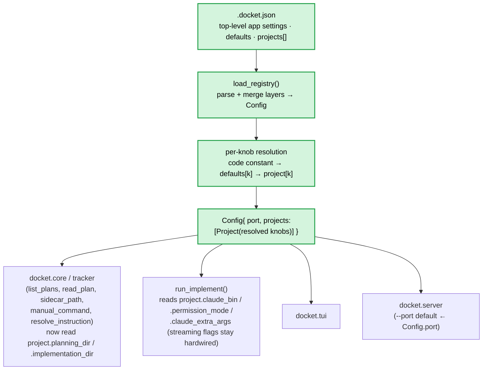

# ITER_01_v2 — Config layering (.docket.json · defaults · per-project)

## §01 · Concept

> Unchanged — see SKELETON § 01.

(The v1 MVP — reached at ITER_03 — stands as built. v2 changes only *how docket is
configured*, not what it does: every previously-hardcoded knob becomes a config entry, with
a global baseline and per-project overrides. No lifecycle, run, or frontend behaviour
changes.)

## §02 · Architecture

This iteration makes the registry the **whole** config and gives it three layers. Nothing in
the run/lifecycle/streaming machinery from ITER_01–03 changes shape; what changes is that the
values those pieces read are now **resolved from config** instead of module constants.

### Config layers (new)



Three tiers, distinct roles:

- **Top-level** — app settings that are not per-project. In v2 that is just `port` (and the
  optional `$schema` pointer, ITER_02_v2, which is read-and-ignored at load).
- **`defaults`** — the baseline for every per-project knob. Anything a project doesn't set
  inherits from here.
- **`projects[]`** — each entry overrides any subset of the `defaults` knobs; `name` + `path`
  are required, everything else optional.

### Resolution cascade

Per-project knob, resolved **at load** into a concrete `Project` field (lowest → highest
precedence): **code constant** (`CODE_DEFAULTS`, the existing SKELETON §04 fallbacks) →
**`defaults.<key>`** → **`project.<key>`**. For the instruction template only, a fourth and
highest layer applies later, at submit time: the **per-plan override** (ITER_03 §04,
unchanged). The app-level `port` resolves: **code default 8765** → **`Config.port`** →
**`--port` flag** (flag still wins, set in `serve`).

Baking the merge into each `Project` at load keeps every downstream reader unchanged in
shape — `run_implement` still just reads `project.allowed_tools`, etc. The only genuinely new
downstream reads are `project.claude_bin`, `project.permission_mode`,
`project.claude_extra_args` (§06).

### Data model (extends ITER_01; only grows)

- **Config** *(new, top-level)* — `port` (int, default 8765), `projects` (list[Project]).
  Built by `load_registry`. (`load_registry` now returns a `Config`, not a bare
  `list[Project]` — see §04 for the two call-site updates.)
- **Project** *(extended)* — existing `name`, `path`, `allowed_tools`, `instruction_template`
  (was an optional top-level registry field in v1; now a resolved per-project field),
  `model`, `max_turns`, **plus** `permission_mode` (str, default `acceptEdits`),
  `planning_dir` (str, default `.agents_workspace/planning`), `implementation_dir` (str,
  default `.agents_workspace/implementation`), `claude_bin` (str, default `claude`),
  `claude_extra_args` (list[str], default `[]`). Every field except `name`/`path` is optional
  in JSON and filled by the cascade. No field's meaning changes from v1 — this strictly adds.
- **Plan / Sidecar / Run / Batch** — > Unchanged — see SKELETON § 02. (Plans and sidecars now
  live under the *resolved* `project.planning_dir` / `project.implementation_dir` rather than
  the module constants, but their shape is identical.)

### API surface

> Unchanged — see SKELETON § 02, **except** `GET /api/instruction-template` gains optional
> `?project=&slug=` params and returns the **effective** template for that plan (project
> override → defaults → code constant, `{path}` resolved). With no params it still returns the
> global default. This is what keeps the browser's pre-filled instruction box correct once a
> project can override the template — see §05. CORS/auth/localhost story: > Unchanged — see
> ITER_03 § 04.

## §03 · Tech Stack

> Unchanged — see SKELETON § 03. No new dependency: still stdlib `json` only (the new config
> layers are plain JSON), `pathlib`, `os`, `shutil` (the `claude_bin` preflight in §06). No
> `jsonschema`, no `tomllib`, no PyYAML.

## §04 · Backend

The change is concentrated in `core.py` (parse + merge + resolved fields) and rippling into
every function that referenced the module-level `PLANNING_DIR` / `IMPL_DIR`. `tracker.py`
write logic is untouched; only its path source changes.

### `core.py` — constants stay as the bottom of the cascade

The SKELETON §04 constants are **not deleted** — they become the last-resort fallback layer.
Add the missing ones and a single `CODE_DEFAULTS` table:

```python
DEFAULT_ALLOWED_TOOLS        = ["Read", "Edit", "Write",
                                "Bash(pytest:*)", "Bash(npm test:*)", "Bash(npm run test:*)"]
DEFAULT_INSTRUCTION_TEMPLATE = "Read the plan at {path} and implement it fully. ..."  # SKELETON §06
DEFAULT_PORT             = 8765
DEFAULT_MAX_TURNS        = 30
DEFAULT_PERMISSION_MODE  = "acceptEdits"
PERMISSION_MODES         = ("acceptEdits", "default", "plan", "bypassPermissions")  # confirm vs installed CC
DEFAULT_PLANNING_DIR     = ".agents_workspace/planning"
DEFAULT_IMPL_DIR         = ".agents_workspace/implementation"
DEFAULT_CLAUDE_BIN       = "claude"
DEFAULT_CLAUDE_EXTRA     = []

CODE_DEFAULTS = {
    "allowed_tools":        DEFAULT_ALLOWED_TOOLS,
    "instruction_template": DEFAULT_INSTRUCTION_TEMPLATE,
    "model":                None,
    "max_turns":            DEFAULT_MAX_TURNS,
    "permission_mode":      DEFAULT_PERMISSION_MODE,
    "planning_dir":         DEFAULT_PLANNING_DIR,
    "implementation_dir":   DEFAULT_IMPL_DIR,
    "claude_bin":           DEFAULT_CLAUDE_BIN,
    "claude_extra_args":    DEFAULT_CLAUDE_EXTRA,
}
```

```python
@dataclass
class Project:
    name: str
    path: str
    allowed_tools: list[str]
    instruction_template: str
    model: str | None
    max_turns: int
    permission_mode: str
    planning_dir: str
    implementation_dir: str
    claude_bin: str
    claude_extra_args: list[str]

@dataclass
class Config:
    port: int
    projects: list[Project]
```

### `core.py` — `load_registry` parses + merges the layers

```python
def load_registry(path: str | None = None) -> Config:
    p = _resolve_registry_path(path)        # cascade below; None if nothing found
    if p is None:
        return Config(port=DEFAULT_PORT, projects=[])   # empty state (frontends show search paths)

    data = json.loads(Path(p).read_text())
    if not isinstance(data, dict) or not isinstance(data.get("projects"), list):
        raise ValueError(f"{p}: expected an object with a 'projects' array")

    defaults = dict(data.get("defaults", {}))
    # Lenient v1 carry-over: a top-level instruction_template (v1 shape) seeds defaults if absent.
    if "instruction_template" in data and "instruction_template" not in defaults:
        defaults["instruction_template"] = data["instruction_template"]

    pick = lambda raw, k: raw.get(k, defaults.get(k, CODE_DEFAULTS[k]))
    seen, projects = set(), []
    for raw in data["projects"]:
        if "name" not in raw or "path" not in raw:
            raise ValueError(f"{p}: every project needs 'name' and 'path'")
        if raw["name"] in seen:
            raise ValueError(f"{p}: duplicate project name {raw['name']!r}")
        seen.add(raw["name"])
        abspath = os.path.abspath(os.path.expanduser(os.path.expandvars(raw["path"])))
        if not os.path.isdir(abspath):
            raise ValueError(f"{p}: project {raw['name']!r} path is not a directory: {abspath}")
        projects.append(Project(
            name=raw["name"], path=abspath,
            allowed_tools        = pick(raw, "allowed_tools"),
            instruction_template = pick(raw, "instruction_template"),
            model                = pick(raw, "model"),
            max_turns            = pick(raw, "max_turns"),
            permission_mode      = pick(raw, "permission_mode"),
            planning_dir         = pick(raw, "planning_dir"),
            implementation_dir   = pick(raw, "implementation_dir"),
            claude_bin           = pick(raw, "claude_bin"),
            claude_extra_args    = list(pick(raw, "claude_extra_args")),
        ))
    return Config(port=data.get("port", DEFAULT_PORT), projects=projects)
```

- **No `@lru_cache` on the loader.** Resolve fresh each call so a test (or a frontend
  restart) that points `$DOCKET_REGISTRY`/`--registry` at a different file picks it up — a
  cached settings singleton would silently capture the first file and load the wrong projects.
- **`path` expansion** runs `expandvars` then `expanduser` then `abspath`, so both `~` and
  `$VAR` resolve — e.g. `"$WORK/repos/x"` works, letting one `.docket.json` be portable across
  machines whose repo roots differ. (`claude_bin` gets the same treatment at run time, §06.)
- Errors keep ITER_01's clear, offender-naming style (`name` missing/duplicate, `path` not a
  dir, top-level shape wrong) → HTTP 500 with the message in the browser, log pane in the TUI.

### Registry discovery — renamed cascade

`_resolve_registry_path` is unchanged in logic, only in filename (first match wins):
`--registry PATH` → `$DOCKET_REGISTRY` → **`./.docket.json`** (was `./projects.json`) →
**`~/.config/docket/.docket.json`** (was `…/projects.json`). The env var `DOCKET_REGISTRY` is
unchanged. **No automatic migration** from a v1 `projects.json`: docket no longer looks for
that name. A top-level `instruction_template` is leniently promoted into `defaults` (above),
but the file itself is not auto-renamed — point `--registry old.json` at it once, or
regenerate with `docket init --scan` (ITER_02_v2). Stated, not silent.

### Ripple — functions now read resolved dirs, not module constants

Every function that referenced `PLANNING_DIR` / `IMPL_DIR` now takes its directory from the
`Project`:

- `list_plans(project)` — globs `Path(project.path)/project.planning_dir/"**"/"*.md"`; slug is
  relative to `project.planning_dir`.
- `read_plan(project, slug)` — reads under `project.planning_dir`.
- `tracker.sidecar_path(project, slug)` — under `project.implementation_dir`.
- `manual_command(project, slug)` — embeds `project.planning_dir` in the printed command.
- `resolve_instruction(project, slug, override)` — `path = f"{project.planning_dir}/{slug}.md"`;
  `template = override or project.instruction_template` (the module
  `REGISTRY_INSTRUCTION_TEMPLATE` from ITER_03 is gone — superseded by the resolved field).
- `reset_stale_runs(config.projects)` — walks each project's `implementation_dir`.

`safe_slug` validation (ITER_01 §04) is unchanged and still applied everywhere a slug is used.

### Call-site updates for the `Config` return

`load_registry` returns `Config` now, not `list[Project]`. Two internal call sites adjust:
the TUI and server use `config.projects` where they used the old list, and `server.py` reads
`config.port` as the default for `--port` (flag still overrides). No endpoint contract changes
beyond `/api/instruction-template` below.

### `/api/instruction-template` — effective template

`GET /api/instruction-template[?project=&slug=]` → `{"template": "..."}`. With `project`+`slug`,
return `resolve_instruction(project, slug, None)` (project override → defaults → constant,
`{path}` filled) so the browser's pre-fill matches what an un-edited submit would run. With no
params, return the global default (`defaults.instruction_template` or the constant, `{path}`
left literal). URL-decode `slug`; unknown project/slug → 404; invalid slug → 400.

### `.docket.json` sample (committed; the v2 shape)

```json
{
  "$schema": "<absolute path to docket.schema.json, written by `docket init` — ITER_02_v2>",
  "port": 8765,
  "defaults": {
    "allowed_tools": ["Read", "Edit", "Write", "Bash(pytest:*)", "Bash(npm test:*)", "Bash(npm run test:*)"],
    "instruction_template": "Read the plan at {path} and implement it fully. The plan may reference sibling files (e.g. a SKELETON or earlier iterations) — read those as needed. Make the code changes the plan describes.",
    "model": null,
    "max_turns": 30,
    "permission_mode": "acceptEdits",
    "planning_dir": ".agents_workspace/planning",
    "implementation_dir": ".agents_workspace/implementation",
    "claude_bin": "claude",
    "claude_extra_args": []
  },
  "projects": [
    { "name": "pyxyflow", "path": "~/code/pyxyflow" },
    { "name": "mcp-harness", "path": "~/code/mcp-harness", "model": "claude-sonnet-4-6", "max_turns": 40 }
  ]
}
```

Every `defaults` key is optional (omit → the code constant). A project listing only `name` +
`path` inherits the whole `defaults` block. **Override semantics: replace, not merge** —
`allowed_tools` (or any list) on a project fully replaces the `defaults` list, matching v1's
constant-replacement behaviour. (An additive `extra_allowed_tools` is a clean post-v2 add;
deferred — ITER_02_v2 §"Out of MVP scope".)

### Run locally

> Unchanged — see SKELETON § 04 (`docket tui` / `docket serve`), except the registry the two
> subcommands resolve is now `.docket.json` and `serve`'s default port comes from `Config.port`.

## §05 · Frontend

No new screens, components, or controls — the config tiers are entirely backend-internal, and
docket still has **no config-editing UI** (deferred — ITER_02_v2 §"Out of MVP scope"). The
only wiring change is the **instruction pre-fill source**, so a per-project template override
is honoured instead of being shadowed by a stale global pre-fill:

- **Browser:** the `Implement` box (and each per-plan box in a batch) pre-fills from
  `GET /api/instruction-template?project=&slug=` (the *effective* template for that plan)
  rather than the param-less global. Everything else — POST `/api/implement`, the EventSource
  streaming, stop, manual controls — > Unchanged — see ITER_03 § 05.
- **TUI:** the `[Implement]` prompt pre-fills from `resolve_instruction(project, slug, None)`
  (project-aware) instead of the old global template. All other bindings > Unchanged — see
  ITER_03 § 05.

Loading/error/empty states: > Unchanged — see ITER_01 § 05 (the empty state still lists the
resolved search paths, now ending in `.docket.json`).

## §06 · LLM / Prompts

Implementation is still delegated to `claude -p` headless; docket makes no direct
LLM-provider calls. v2 changes only **which knobs are configurable** on the invocation.

`run_implement` now sources three values from the resolved `Project` instead of hardwiring
them; the streaming contract stays hardwired. Before spawning, it expands and **preflights**
`claude_bin` so a misconfigured binary fails with a clear message instead of a raw
`FileNotFoundError` mid-spawn:

```python
bin_ = os.path.expandvars(os.path.expanduser(project.claude_bin))
if shutil.which(bin_) is None and not os.path.isfile(bin_):    # PATH lookup or explicit file
    raise FileNotFoundError(f"claude_bin {project.claude_bin!r} not found on PATH")

cmd = [bin_, "-p",                                            # was hardcoded "claude"
       "--output-format", "stream-json", "--verbose",        # HARDWIRED — streaming invariant
       "--permission-mode", project.permission_mode,         # was hardcoded "acceptEdits"
       "--max-turns", str(project.max_turns),
       "--allowedTools", ",".join(project.allowed_tools)]
if project.model:
    cmd += ["--model", project.model]
cmd += project.claude_extra_args                             # additive escape hatch, appended last
```

The preflight runs **inside** `run_implement` but **before** `set_status(..., "running")` and
the lock acquire — a bad `claude_bin` must not flip the plan to `running` or strand the
project lock. (`docket doctor`, ITER_02_v2 §04, surfaces the same check ahead of any run.)

- **`--output-format stream-json --verbose` stays hardwired** — it is a correctness invariant
  (drop it and the log stops streaming; ITER_03 §04). It is deliberately *not* a config knob.
  `claude_extra_args` is the additive escape hatch for flags you legitimately want (e.g.
  `--add-dir`); it is appended last and is the user's responsibility — don't restate the
  streaming flags in it.
- **Instruction template** resolution is unchanged in mechanism (ITER_03 §04: default template
  with `{path}`, or per-plan override at submit) — only its *source* moves to the resolved
  `project.instruction_template` / `defaults` (§04). A re-run from `implemented` is still a
  fresh session with new instruction text.
- No message array, no system-prompt construction, no context-window management on docket's
  side — Claude Code owns the conversation. Role/context gotchas still do not apply.
