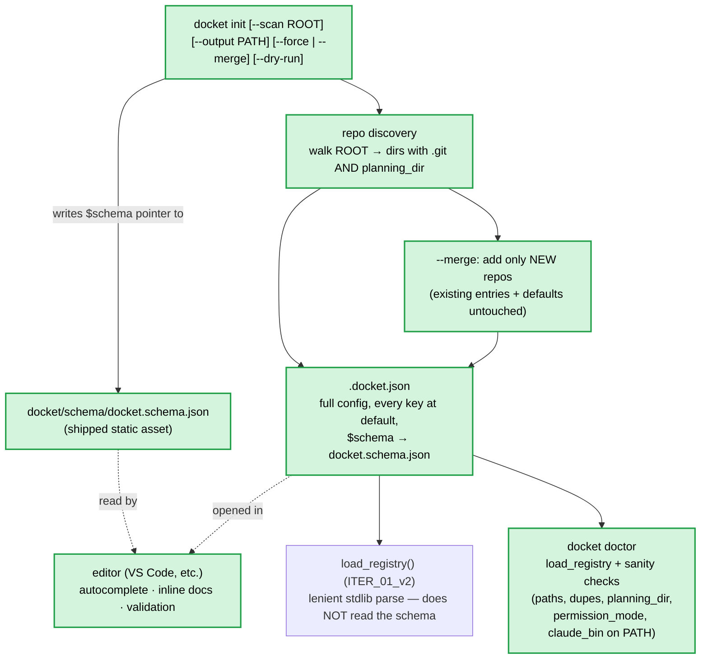

# ITER_02_v2 — `docket init` + shipped JSON Schema (v2 MVP)

## §01 · Concept

> Unchanged — see SKELETON § 01.

## §02 · Architecture

This iteration adds **no runtime behaviour** — the running app is exactly ITER_01_v2. It adds
a config-authoring affordance (`docket init`) and an editor-side schema so the
`.docket.json` from ITER_01_v2 is generated and edited safely instead of by hand from a blank
file.



- **Data model:** > Unchanged — see ITER_01_v2 § 02. The schema *describes* the existing
  `Config`/`Project` shape; it introduces no new entity or field. Runtime loading is unchanged
  and **does not** consult the schema (see §03).
- **`docket init`** and **`docket doctor`** are the third and fourth `__main__` subcommands
  alongside `tui` and `serve`; `init` writes the registry, `doctor` reads and checks it —
  neither runs the app.

## §03 · Tech Stack

> Unchanged — see SKELETON § 03, with one clarification to forestall a wrong turn: **no
> `jsonschema` (or any) new dependency.** The JSON Schema is a **static shipped asset consumed
> by editors only** (VS Code et al. via the `$schema` pointer) — docket does **not** validate
> `.docket.json` against it at runtime. Runtime loading keeps ITER_01_v2's lenient,
> offender-naming stdlib checks. Uses stdlib `os`, `pathlib`, `json`, `argparse`,
> `importlib.resources` (to locate the shipped schema), and `shutil` (`doctor`'s `claude_bin`
> PATH check) only.

## §04 · Backend

Two deliverables: the `init` subcommand in `core.py` + `__main__.py`, and the shipped schema
file.

### File structure (additions to SKELETON § 04)

```
docket/
├── pyproject.toml            # + package-data entry so schema/ ships in the wheel
└── docket/
    ├── __main__.py           # + `init` and `doctor` dispatch (alongside tui | serve)
    ├── core.py               # + cmd_init(), discover_repos(), cmd_doctor()
    └── schema/
        └── docket.schema.json   # shipped JSON Schema (2020-12) describing .docket.json
```

### `__main__.py` — dispatch

Add two subcommands to the parser:
- `docket init [--scan ROOT] [--output PATH] [--force | --merge] [--dry-run]` — `--output`
  defaults to `./.docket.json`; `--scan` pre-populates `projects`; `--force` overwrites,
  `--merge` updates in place (mutually exclusive); `--dry-run` prints the result without
  writing.
- `docket doctor [--registry PATH]` — loads the registry (same cascade) and reports problems;
  exit code `0` if clean, `1` if any error-level finding.

`tui` / `serve` dispatch is > Unchanged — see ITER_03 § 04 (and `serve`'s `--port` default now
reads `Config.port`, ITER_01_v2 § 04).

### `core.py` — `cmd_init`

```python
def cmd_init(output: str = ".docket.json", scan: str | None = None,
             force: bool = False, merge: bool = False, dry_run: bool = False) -> str:
    target = Path(output)
    discovered = discover_repos(scan) if scan else []

    if merge:                                       # update in place, preserve hand edits
        if not target.exists():
            raise FileNotFoundError(f"{target} does not exist — run a plain `init` first")
        config = json.loads(target.read_text())
        existing = config.setdefault("projects", [])
        have_paths = {p.get("path") for p in existing}
        have_names = {p.get("name") for p in existing}
        added = 0
        for repo in discovered:                     # add only genuinely new repos
            if repo["path"] in have_paths:
                continue                            # same repo already listed → skip
            name = repo["name"]
            while name in have_names:               # keep names unique against existing
                name = _suffix(name)
            existing.append({"name": name, "path": repo["path"]})
            have_paths.add(repo["path"]); have_names.add(name); added += 1
        existing.sort(key=lambda e: e["name"])
        summary = f"{'would add' if dry_run else 'added'} {added} new project(s) to {target}"
    else:                                           # fresh file
        if target.exists() and not force and not dry_run:
            raise FileExistsError(f"{target} exists — pass --force to overwrite or --merge to update")
        config = {
            "$schema": _schema_path(),              # absolute path to the shipped schema
            "port": DEFAULT_PORT,
            "defaults": {
                "allowed_tools":        DEFAULT_ALLOWED_TOOLS,
                "instruction_template": DEFAULT_INSTRUCTION_TEMPLATE,
                "model":                None,
                "max_turns":            DEFAULT_MAX_TURNS,
                "permission_mode":      DEFAULT_PERMISSION_MODE,
                "planning_dir":         DEFAULT_PLANNING_DIR,
                "implementation_dir":   DEFAULT_IMPL_DIR,
                "claude_bin":           DEFAULT_CLAUDE_BIN,
                "claude_extra_args":    DEFAULT_CLAUDE_EXTRA,
            },
            "projects": discovered,
        }
        summary = f"{'would write' if dry_run else 'wrote'} {target} ({len(discovered)} project(s))"

    rendered = json.dumps(config, indent=2) + "\n"
    if dry_run:
        print(rendered)                             # show, don't touch disk
        return summary
    tmp = target.with_suffix(target.suffix + ".tmp")  # atomic write (sidecar pattern, ITER_02 §04)
    tmp.write_text(rendered)
    os.replace(tmp, target)                          # crash can't leave a half-written config
    return summary
```

- **Complete file, every key present at its default** — kills the blank-page problem: you
  never start config from nothing, you start from a fully-populated valid file and trim/edit.
- **`--merge` is the re-run path** as your ~10 repos drift: it adds only repos whose `path`
  isn't already listed and **never touches** existing project entries, `defaults`, `port`, or
  `$schema` — so a monthly `docket init --scan ~/code --merge` picks up new repos without
  destroying hand-tuned overrides. `--merge` requires an existing target and a `--scan` source.
  Name collisions against existing entries get a deterministic suffix (`_suffix`, same scheme
  as `discover_repos`). `--force` and `--merge` are mutually exclusive (overwrite vs update).
- **`--dry-run`** renders the exact resulting JSON to stdout and writes nothing — preview a
  fresh file or see what a `--merge` would add before committing.
- **No-clobber:** a fresh `init` refuses an existing target unless `--force` (or `--merge`);
  never silently overwrites a hand-tuned config.
- **`$schema` pointer** (`_schema_path()`): resolve the shipped schema's location from the
  installed package via `importlib.resources.files("docket") / "schema" / "docket.schema.json"`
  and emit it as an **absolute** path so editor autocomplete works regardless of where
  `.docket.json` lives. Tradeoff: the path is machine-specific — if the install moves, rerun
  `docket init` (or hand-fix the one line). Acceptable for a local single-user tool; stated,
  not silent.

### `core.py` — `discover_repos`

```python
def _suffix(name: str) -> str:                      # foo → foo-2, foo-2 → foo-3, ...
    base, _, n = name.rpartition("-")
    return f"{base}-{int(n) + 1}" if base and n.isdigit() else f"{name}-2"

def discover_repos(root: str) -> list[dict]:
    base = Path(root).expanduser()
    home = Path.home()
    found, names = [], set()
    for git in base.rglob(".git"):                  # a repo is a dir containing .git
        repo = git.parent
        if not (repo / DEFAULT_PLANNING_DIR).is_dir():
            continue                                # only repos that actually hold plans
        name = repo.name
        while name in names:                        # dedupe collisions deterministically
            name = _suffix(name)
        names.add(name)
        # tidy, portable path: ~-relative when under $HOME, else absolute
        p = repo.resolve()
        disp = f"~/{p.relative_to(home)}" if p.is_relative_to(home) else str(p)
        found.append({"name": name, "path": disp})
    return sorted(found, key=lambda e: e["name"])
```

- Discovers git repos under `ROOT` that **contain `.agents_workspace/planning/`** (matching
  the default `planning_dir`) — so `projects` lists exactly the repos docket can act on, no
  manual enumeration of ~10 paths.
- **Deterministic dedupe** on name collisions (two repos sharing a basename) so a second
  `same-name` becomes `same-name-2`, etc. — `name` must stay unique (`load_registry` rejects
  duplicates, ITER_01_v2 §04).
- **Bounded walk:** `rglob(".git")` stops descending into a repo's internals naturally (we
  match the `.git` dir itself, not its contents); nested submodules are an accepted edge —
  trim the generated list by hand if a submodule shows up. Discovered entries get only
  `name` + `path`; everything else inherits `defaults`.

### `core.py` — `cmd_doctor`

`docket doctor` loads the registry through the normal cascade and reports problems
proactively, so a misconfiguration surfaces once, up front, instead of at first run. It is the
**runtime** sanity answer the schema deliberately isn't (the schema is editor-side only, §03);
pure stdlib, no `jsonschema`.

```python
def cmd_doctor(registry: str | None = None) -> int:
    cfg = load_registry(registry)                   # same lenient parse; raises on hard shape errors
    errors = warns = 0
    if not cfg.projects:
        print("warn: no projects configured"); warns += 1
    for pr in cfg.projects:                          # paths/dupes already validated by load_registry
        plan_dir = Path(pr.path) / pr.planning_dir
        if not plan_dir.is_dir():
            print(f"warn: {pr.name}: no planning dir at {plan_dir}"); warns += 1
        if pr.permission_mode not in PERMISSION_MODES:
            print(f"error: {pr.name}: unknown permission_mode {pr.permission_mode!r}"); errors += 1
        if not pr.allowed_tools:
            print(f"warn: {pr.name}: allowed_tools is empty — every tool will be denied"); warns += 1
        bin_ = os.path.expandvars(os.path.expanduser(pr.claude_bin))
        if shutil.which(bin_) is None and not os.path.isfile(bin_):
            print(f"error: {pr.name}: claude_bin {pr.claude_bin!r} not found on PATH"); errors += 1
    print(f"{len(cfg.projects)} project(s): {errors} error(s), {warns} warning(s)")
    return 1 if errors else 0                        # nonzero exit on any error-level finding
```

- Checks that earn their place: a listed repo missing its `planning_dir` (docket would show it
  empty), a `permission_mode` outside the known set (`PERMISSION_MODES`, the same enum the
  schema lists — confirm against the installed Claude Code), an empty `allowed_tools` (the
  agent would be denied every tool), and — the check that matters once `claude_bin` is
  configurable — the binary not being resolvable on `PATH`. Path-not-a-dir and duplicate names
  are already hard errors in `load_registry`; `doctor` wraps the initial load in `try/except`
  so they print as a clean `error:` finding with exit `1` rather than a traceback.
- **error vs warn:** an `error` is something that *will* break a run (bad `permission_mode`,
  missing `claude_bin`) → exit `1`; a `warn` is suspicious but runnable (no plans yet, empty
  tools) → still exit `0`. This makes `docket doctor` usable as a pre-run/CI gate.

### `docket/schema/docket.schema.json` — shipped schema

A JSON Schema (draft **2020-12**) describing `.docket.json`, shipped as package data (add the
`schema/*.json` glob to `pyproject.toml` package-data / `[tool.setuptools.package-data]` so it
lands in the wheel). It mirrors ITER_01_v2's shape exactly:

- **top-level:** `$schema` (string), `port` (integer), `defaults` (object), `projects`
  (array); `projects` required, the rest optional; `additionalProperties:false` to catch typos.
- **`defaults`:** all nine knobs, each optional, typed — `allowed_tools`/`claude_extra_args`
  as `array<string>`, `max_turns` integer, `model` `["string","null"]`, `permission_mode` an
  `enum` drawn from `PERMISSION_MODES` (the single source `cmd_doctor` also checks against —
  `acceptEdits`, `default`, `plan`, `bypassPermissions`; confirm the set against the installed
  Claude Code and keep the constant and the schema enum in sync), the three dir/bin fields
  strings.
- **`projects[]` items:** `name` + `path` **required**; every `defaults` knob repeated as an
  optional per-project override; `additionalProperties:false`.

Because it's shipped static and consumed only by editors, it adds no runtime cost and no
dependency, while making the hand-edits you still do (the common case after `init`)
autocompleted, documented, and validated in-editor.

## §05 · Frontend

> Unchanged — see ITER_03 § 05 and ITER_01_v2 § 05. `docket init` is a CLI command with no UI
> surface; docket still has no in-app config editor (see below).

## §06 · LLM / Prompts

> Unchanged — see ITER_01_v2 § 06. `docket init` performs no LLM activity; it only generates a
> config file.

## Out of MVP scope

The hard edge of the v2 MVP — consciously excluded:

- **In-UI config editing** (config-write endpoints) — keeps docket's mutation surface to
  status sidecars only; `init` + schema cover authoring.
- **Granular per-key mutators** (`docket config set`, `docket project add`) — `init --merge`
  already covers the one case that actually recurs (adding repos as they appear), and `init` +
  the schema cover authoring; per-key setters are hand-rolled code for marginal gain.
- **Additive `allowed_tools` merge** (`extra_allowed_tools`) — v2 override is replace-only.
- **Runtime schema validation / a `jsonschema` dependency / `docket validate`** — the schema
  is editor-side only; runtime loading stays lenient stdlib checks.
- **Automatic migration from a v1 `projects.json`** — run `docket init --scan` to regenerate;
  a top-level `instruction_template` is leniently promoted into `defaults`, but the file is not
  auto-renamed.
- **Config hot-reload / file-watching of `.docket.json`** — loaded once per process start, as
  today.
- **Everything still deferred from the v1 MVP** — parallel-run TUI, auto-commit/branch/PR,
  in-UI diff viewer, epic→feature hierarchy, persisted run-process history, auth/multi-user/
  remote access, file-watching `planning/`. See ITER_03 § "Out of MVP scope".
