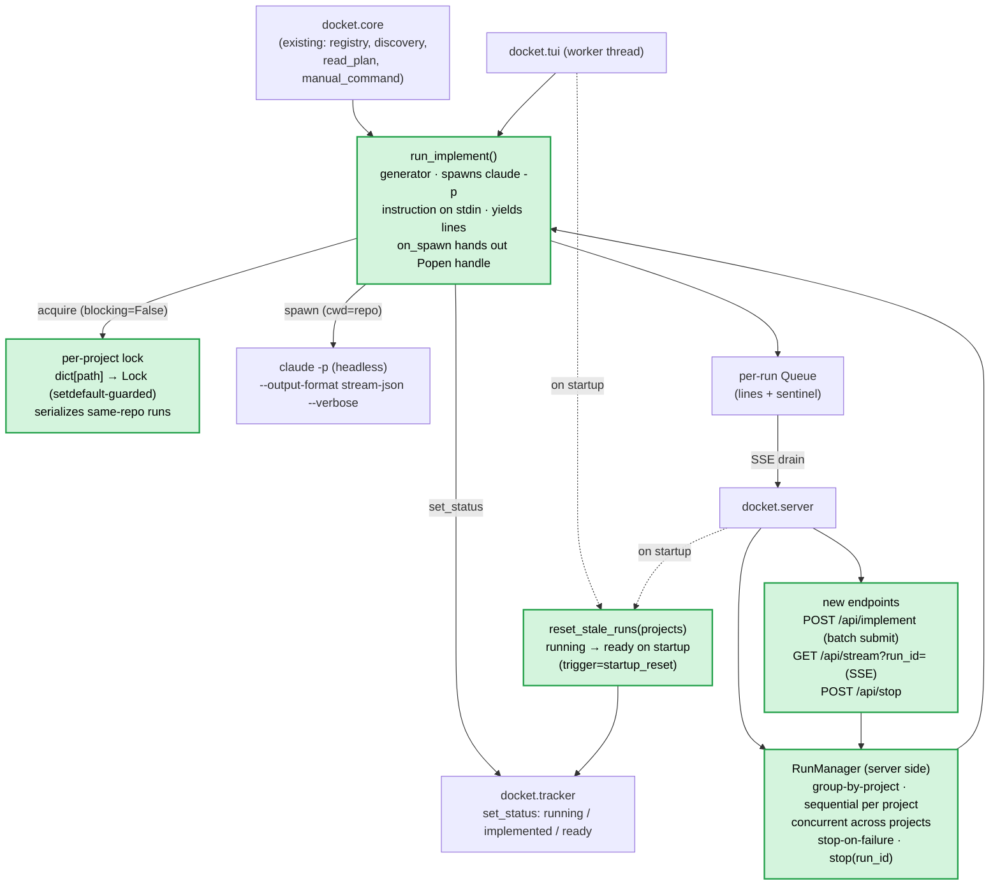

# ITER_03 — Headless run + per-project batch + streaming (MVP)

## §01 · Concept

> Unchanged — see SKELETON § 01.

## §02 · Architecture

This iteration adds **headless running** — the only subprocess path in docket — plus the
**batch** model and **startup recovery**. Manual mode (ITER_02) is untouched.

### Component diagram (this iteration — new pieces highlighted)



New pieces in `core.py`:

- `run_implement(project, slug, instruction, *, on_spawn=None)` — a generator that spawns
  `claude -p`, **pipes the `instruction` (which names the plan file) on stdin**, and
  **yields display lines**. `on_spawn` hands the process handle to the caller (so the TUI
  and `RunManager.stop` can terminate it). Used directly by the TUI worker thread.
- **Per-project lock** (`dict[path] -> threading.Lock`, the dict itself guarded by a
  module-level lock or built via `setdefault` so two threads can't create competing locks)
  so two headless implements on the **same repo** can't run at once (their working-tree
  edits would collide). This is the boundary that makes a batch *sequential within a
  project*. Within one process the lock is enforced; running the TUI and the server against
  the **same repo simultaneously** is not cross-process-locked — accepted MVP limitation,
  noted in the README.
- `RunManager` — the server's run + **batch** orchestrator. Accepts a submission, groups it
  **by project**, and runs each project's items **sequentially in its own daemon thread**;
  different projects' threads run **concurrently** (they never contend on the lock since they
  hold different repos' locks). Tracks every item by `run_id`, exposes each run's queue to
  the SSE handler, and supports `stop(run_id)`.
- `reset_stale_runs(projects)` — startup recovery; walks every sidecar and flips `running →
  ready` (`trigger="startup_reset"`, logged). Both frontends call it on startup.

New endpoints: `POST /api/implement` (batch submit), `GET /api/stream?run_id=` (SSE),
`POST /api/stop`. Shapes in §04. Everything else: > Unchanged — see SKELETON § 02.

## §03 · Tech Stack

> Unchanged — see SKELETON § 03. Uses stdlib `subprocess`, `threading`, `queue`, `uuid`,
> and `json` (parsing stream-json events) only — plus `pty` if the buffering fallback in
> §04 is needed. No new pip dependency.

## §04 · Backend

### `core.run_implement(project, slug, instruction)` — the headless invocation

Preconditions: plan status must be `ready` **or** `implemented` (the latter is a re-run);
otherwise raise. Acquire the project lock (§02); if held, raise "a run is already active for
this project". On start, `set_status(..., "running", trigger="headless", run_id=...)`.

The **prompt piped on stdin is the `instruction`, not the plan body** — the instruction
names the plan file and Claude Code reads it itself. The instruction text is resolved by the
caller (default template with `{path}` filled, or a per-plan override; see §06). The lock is
held for the whole run and released in `finally`; `on_spawn` hands the `Popen` handle to the
caller so `stop()` (and the TUI) can terminate it:

```python
def run_implement(project, slug, instruction, *, on_spawn=None, run_id=None):
    slug = safe_slug(slug)
    rec = tracker.read_record(project, slug)
    if rec["status"] not in ("ready", "implemented"):
        raise ValueError(f"{project.name}/{slug} is '{rec['status']}', not runnable")
    lock = project_lock(project.path)                # setdefault-guarded dict (§02)
    if not lock.acquire(blocking=False):
        raise RuntimeError("a run is already active for this project")
    try:
        tracker.set_status(project, slug, "running", trigger="headless", run_id=run_id)
        allow = ",".join(project.allowed_tools)      # ONE comma-separated value (CC's form)
        cmd = ["claude", "-p",
               "--output-format", "stream-json", "--verbose",
               "--permission-mode", "acceptEdits",   # auto-apply edits unattended; tools
                                                     # still gated by --allowedTools (anything
                                                     # outside the allowlist is denied, never
                                                     # prompts)
               "--max-turns", str(project.max_turns),
               "--allowedTools", allow]
        if project.model:
            cmd += ["--model", project.model]
        proc = subprocess.Popen(
            cmd, cwd=project.path,                    # runs IN the repo
            stdin=subprocess.PIPE,
            stdout=subprocess.PIPE, stderr=subprocess.STDOUT,
            text=True, bufsize=1,
        )
        if on_spawn:
            on_spawn(proc)                            # caller stashes proc for stop()
        proc.stdin.write(instruction)                 # INSTRUCTION (names the plan file)
        proc.stdin.close()                            # NOT the plan body
        try:
            for raw in proc.stdout:                   # NDJSON, one event per line
                line = format_event(raw)              # -> human-readable str, or None to skip
                if line is not None:
                    yield line
            proc.wait()
        finally:
            proc.stdout.close()
        ok = proc.returncode == 0
        tracker.set_status(project, slug, "implemented" if ok else "ready",
                           trigger="headless", run_id=run_id, rc=proc.returncode)
        yield f"[docket] run {'completed' if ok else f'ended (rc={proc.returncode})'}"
    finally:
        lock.release()
```

`format_event(raw)` parses each NDJSON line into a short display string: assistant **text**
content → the text; **tool_use** → `▸ {ToolName}` (+ a one-line arg digest, e.g. the edited
path); the final **result** event → a `[done]`/`[error]` summary; the `system` init event →
skip. A line that isn't valid JSON is passed through verbatim (defensive).

Notes:
- **Instruction, not body:** the change from the original design. We pipe the short
  instruction; Claude Code opens
  `.agents_workspace/planning/<slug>.md` itself. This keeps stdin tiny and lets the plan
  reference siblings (a SKELETON, earlier iterations) that Claude Code can also open. stdin
  (not argv) is still used so free-form per-run instruction text needs no shell quoting.
- **Why stream-json, not plain `-p`:** with the default `text` format, `claude -p` prints
  only the final result *at completion* — no live stream. `--output-format stream-json`
  emits events (`system` init, `assistant`/`user` messages, final `result`) as they happen,
  which is what makes the log update in real time; `--verbose` is paired with it for full
  event output. **Flags drift across Claude Code versions** — confirm `--output-format
  stream-json [--verbose]`, `--permission-mode`, and `--allowedTools` against `claude --help`
  for the installed version, and drop `--verbose` if that build rejects the combination.
- **Child-side buffering:** `bufsize=1` controls only the parent's read buffer; a child
  detecting a non-TTY may still block-buffer. `stream-json` flushes per event so this is
  largely a non-issue, but if output still arrives in large chunks, run the child under a pty
  (`pty.openpty()`).
- Scoped `--allowedTools` keeps the agent off arbitrary bash; the default allowlist is in
  SKELETON §04, overridable per project. The run leaves working-tree changes; docket does
  **not** commit — your review of the diff (`git diff` / your editor) is the final step.
  Auto-commit is out of MVP scope.

### Instruction resolution

```python
def resolve_instruction(project, slug, override: str | None) -> str:
    path = f"{PLANNING_DIR}/{slug}.md"                # repo-relative path to the plan
    template = override or REGISTRY_INSTRUCTION_TEMPLATE or DEFAULT_INSTRUCTION_TEMPLATE
    return template.format(path=path)                 # {path} substituted; other text kept
```

- Global default: `DEFAULT_INSTRUCTION_TEMPLATE` (SKELETON §04), or the registry's optional
  top-level `instruction_template` (read in ITER_01) if present.
- **Per-plan override:** each batch item may carry its own `instruction` string; if it
  contains `{path}` it's substituted, otherwise it's used verbatim. This is how you give a
  **different instruction to each plan in a batch**, and how a **re-run from `implemented`**
  works — it's just a normal submit with fresh instruction text (a brand-new session;
  nothing is appended to any prior run).

### `RunManager` (server side) — runs **and** batches

- `submit(items) -> list[run]`: `items` is `[{project, slug, instruction?}, ...]`. Validate
  each (known project, `safe_slug`, runnable status) — a bad item fails the whole submit with
  a 4xx before any thread starts. Create a `run_id = uuid4().hex`, a `Queue`, and a `Run`
  record (`state="queued"`) for **every** item up front, and return them all (so the browser
  can open an SSE stream per `run_id` immediately). **Group items by project**; for each
  project spawn one daemon thread that processes its items **in order**:
  - For each item: set `state="running"`, iterate
    `run_implement(..., on_spawn=lambda p: setattr(run, "proc", p), run_id=run_id)`, putting
    each line on that run's queue, then a sentinel; set `state` to `done`/`failed` by rc.
  - **Stop-on-failure (per project):** if an item ends `failed` **or** `stopped`, mark every
    *remaining* item in that project's queue `state="skipped"`, put a sentinel on each of
    their queues, and stop the thread. Other projects' threads are unaffected (point: a
    failure isolates to its project's batch).
  - A `ValueError`/`RuntimeError` from a precondition or lock that occurs *at the moment an
    item starts* (e.g. the repo got locked by the TUI) marks that item `failed` and triggers
    the same per-project stop.
- `stream(run_id)`: generator the SSE handler drains — yields queued lines until the
  sentinel; if the run is still `queued`, it simply blocks/keep-alives until its turn.
- `stop(run_id)`: `run.proc.terminate()`, escalate to `kill()` after a short timeout; state
  → `stopped`. The `run_implement` `finally` releases the project lock and reverts the plan
  to `ready`; the per-project batch then stops its remaining items (a stop is treated like a
  failure for batch continuation). The TUI captures `proc` via the same `on_spawn` hook for
  its own Stop binding.

### `reset_stale_runs(projects)` — startup recovery

Runs are in-memory only, so any sidecar persisted as `running` is necessarily orphaned from a
crashed prior process. **On startup, both frontends call `reset_stale_runs(projects)`**,
which walks every project's `implementation/` tree and, for each sidecar reading `running`,
calls `set_status(..., "ready", trigger="startup_reset")`. Returns the list of plans it
reset (frontends can surface a one-line "reset N stale run(s)" notice). This is what
guarantees a crash can't strand a plan at `running`.

### Endpoint shapes (browser)

- `POST /api/implement` — body `{"items":[{"project","slug","instruction"?}, ...]}` →
  `{"runs":[{"project","slug","run_id","state"}]}` (one entry per item, `state` initially
  `queued` or `running`). Any invalid item (unknown project, bad slug, non-runnable status)
  → HTTP 409/400 for the whole submit, nothing started. A single-plan implement is just a
  one-item list; a re-run from `implemented` is a one-item list with fresh `instruction`.
- `GET /api/stream?run_id=` — **SSE** (`Content-Type: text/event-stream`, `Cache-Control:
  no-cache`). Emits `data: <line>\n\n` per output line and a final
  `event: end\ndata: <state>\n\n` (`done`|`failed`|`stopped`|`skipped`). GET-only by
  EventSource constraint — that's why submit is a separate POST (SKELETON §02). Unknown
  `run_id` → 404. Send a periodic `: keep-alive` comment so idle/queued connections aren't
  dropped (the single producer thread owns the queue; the heartbeat is just a timed item the
  SSE loop emits — no cancellation dance).
- `POST /api/stop` — body `{"run_id"}` → `{"ok":true}`. Unknown/finished run → 404/409.
  Stops that run **and** the rest of its project's batch.

`ThreadingHTTPServer` is required (not the single-threaded base) so open SSE streams — and
concurrent per-project batch threads — don't block other requests. Bind to `127.0.0.1` only
(never `0.0.0.0`) — this is the auth story for a local single-user tool: not reachable
off-box. Stated, not silently assumed.

## §05 · Frontend

Wire the headless run controls (disabled since ITER_01) in **both** frontends. Manual
controls from ITER_02 are unchanged. Both frontends call `reset_stale_runs` on startup.

- **TUI:**
  - `[Implement]` binding (enabled when status `ready` or `implemented`) — prompts for an
    instruction (pre-filled with the resolved default template), then starts `run_implement`
    in a Textual **worker thread**; each yielded line is appended to the log pane via
    `call_from_thread`. Badge flips to `running`, then `implemented`/`ready` on completion.
    Re-running an `implemented` plan uses the same binding (fresh instruction prompt).
  - **Batch:** a multi-select on the plan tree → `[Implement selected]` submits all chosen
    plans. The MVP TUI **streams one run at a time**: it processes the selection
    project-by-project, plan-by-plan, showing the active run's log and a small queue
    indicator ("3 queued, 1 running, project X stopped on failure"). Parallel-run TUI is the
    first post-MVP target (see §"Out of MVP scope" below).
  - `[Stop]` binding terminates the active headless run (same terminate path); per-project
    stop-on-failure applies.
  - `[Run myself]`, `[Mark implemented]`, `[Reopen]` — unchanged from ITER_02.
  - Starting a second headless run on a repo that's already running is blocked with a notice
    (matches the per-project lock).
- **Browser:**
  - `Implement` button (enabled when `ready` or `implemented`) — opens a small instruction
    box (pre-filled with `GET /api/instruction-template`'s value, `{path}` resolved),
    `POST /api/implement` with a one-item list, take the `run_id`, open
    `new EventSource('/api/stream?run_id='+id)`, append each `data` line to the log region;
    on the `end` event **call `source.close()`** (stops EventSource's auto-reconnect) and
    re-fetch the plan (status updated) + project list.
  - **Batch:** checkboxes on the plan tree → `Implement selected` opens a per-plan
    instruction panel (each row pre-filled, individually editable — point: different
    instructions per plan), then one `POST /api/implement` with the full item list. The
    browser opens an `EventSource` per returned `run_id`; each streams into its own labelled
    log section (multiple concurrent streams are fine here — `RunManager` runs different
    projects' batches in parallel). A `skipped` run shows its `end` event immediately
    ("skipped — earlier plan in this project's batch failed").
  - `Stop` button → `POST /api/stop` (stops that run and its project's remaining batch).
  - Log region shows an empty state ("no output yet") before the first line. On a mid-run
    connection drop, EventSource auto-reconnects to the same `run_id` and resumes draining
    the live queue — lines delivered before the drop are **not** replayed (drained once;
    acceptable for a local MVP). If the run already finished when a reconnect lands, the
    server returns the `end` event immediately. A terminal EventSource error (server gone)
    shows "stream interrupted — refresh to see final status."
  - `Run myself` / `Mark implemented` / `Reopen` — unchanged from ITER_02.

## §06 · LLM / Prompts

- **Use / model / provider:** as SKELETON §06 — implementation is delegated to `claude -p`
  headless; docket makes no direct LLM-provider calls.
- **Input shape (concrete):** the **instruction** is piped on stdin and **names the plan
  file** (`.agents_workspace/planning/<slug>.md`); the plan body is **not** piped — Claude
  Code reads the file. The instruction is the global default template (registry
  `instruction_template` or `DEFAULT_INSTRUCTION_TEMPLATE`) with `{path}` substituted, or a
  **per-plan override** supplied at submit time. A **re-run** of an `implemented` plan is a
  fresh `claude -p` session with new instruction text — never an append to a prior session.
- **Knobs docket sets:** `--output-format stream-json --verbose`, `--permission-mode
  acceptEdits`, `--max-turns`, `--allowedTools` (scoped, comma-joined), optional `--model`.
  No message array, no system-prompt construction, no context-window management on docket's
  side — Claude Code owns the conversation and its context, so the role-constraint and
  context-overflow gotchas do not apply.
- **Evaluation:** success is you reviewing the resulting working-tree diff; the process
  return code only drives the `implemented` (rc 0) vs `ready` (nonzero/stop) status flip. No
  automated eval of the agent's output in the MVP.

## Out of MVP scope

The hard edge of this MVP — everything consciously left out of the first usable version:

- Authoring/editing/deleting plans inside docket (the planning skill owns plan creation).
- Parallel **headless runs within a single project** (the per-project lock serializes them;
  cross-project batches do run concurrently).
- A **parallel-run TUI** (MVP TUI streams one run at a time; this is the first post-MVP
  target).
- Auto-commit, branch creation, or PR opening after a run (you review the diff manually).
- In-UI diff/diff-viewer rendering (review via `git diff` / your editor).
- Epic → feature grouping / hierarchy across plans (flat per-file plans; subfolders are
  organizational only, not a dependency graph).
- Persisted run **process** history (the sidecar logs status transitions; live run output
  is in-memory only).
- Auth, multi-user, remote/non-localhost access.
- Auto-refresh / file-watching of `planning/` changed outside docket.
