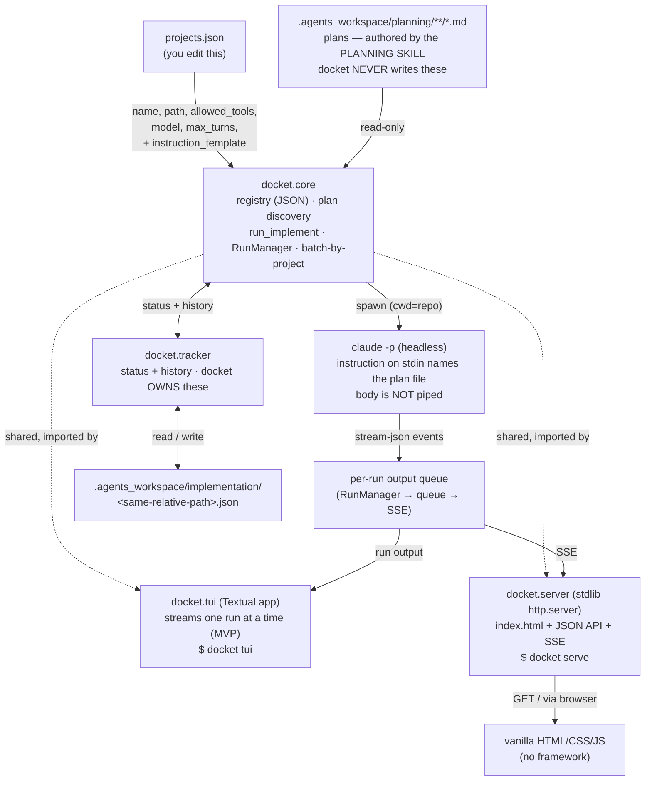
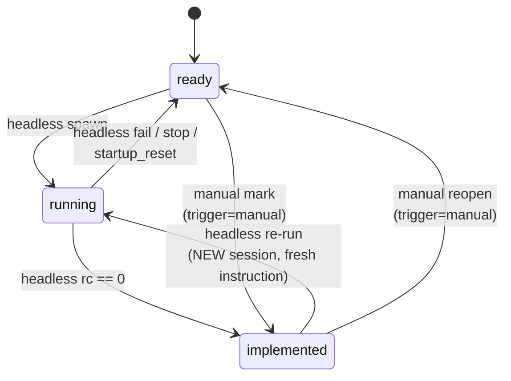

# SKELETON — docket

## §01 · Concept

You work across ~10 local repos. Today you `cd` into each one to run Claude Code against a
plan, one repo at a time. **docket** is a single local command-center over all of them: it
reads a registry of your repos, surfaces every plan and its lifecycle status in one view,
and lets you implement plans — or batches of them — without leaving the tool.

Plans are markdown files that **you author with the planning skill** (iteratively, or
straight to MVP). They live inside each repo under `.agents_workspace/planning/` (any
depth of subfolders). **docket never creates, edits, or deletes a plan** — it only reads
them. The mutable state docket *does* own lives separately under
`.agents_workspace/implementation/`, mirroring the planning tree: one JSON file per plan
holding that plan's current lifecycle status **and** its full transition history. Delete
docket and you lose nothing; delete `implementation/` and you only lose status/history, not
a single plan.

docket is a **plan runner and lifecycle tracker**. A plan moves through three states —
`ready → running → implemented` — and you drive it two ways:

- **Headless** — docket runs Claude Code in the repo and streams the output. The prompt
  piped in is a short instruction that **names the plan file** for Claude Code to read; the
  plan body is never piped. docket sets `running` on spawn and `implemented` on success.
- **Manual** — you run Claude Code yourself; docket hands you a ready-to-paste command and
  the plan path, stays out of the way, and you **mark it implemented** by hand afterward.
  No subprocess, no `running` state — but the manual transition is still logged.

You can submit **many plans at once**. docket groups them by project and runs each
project's plans **sequentially**; if one fails, that project's remaining plans are
abandoned, while other projects' batches continue. After a plan is `implemented` you can
send it **back to `running`** with a fresh, new-session instruction (e.g. follow-up work) —
or reopen it to `ready` to re-mark or hand-run it.

The same flow is available two ways — a terminal UI and a browser page — over one shared
core. The source of truth is always the plan files; status/history is a derived sidecar.

## §02 · Architecture

### Component diagram



No web framework, no database, no auth, no network beyond `localhost`, **no YAML, no
TOML** — the registry and sidecars are both JSON. Two frontends are thin; **all behaviour
lives in `docket.core` + `docket.tracker`** so the second frontend is nearly free.

### Data model (full target shape; realized over the iterations)

- **Project** — from `projects.json`. Fields: `name` (str, unique), `path` (abspath to a
  git repo), `allowed_tools` (optional list[str], defaults to a safe edit+test allowlist),
  `model` (optional str, passed to Claude Code if set), `max_turns` (optional int, caps the
  agent loop on a headless run; default 30).
- **Plan** — a file `<project.path>/.agents_workspace/planning/<slug>.md`, **read-only to
  docket**. `slug` = the file's path **relative to `planning/`, minus the `.md`**, so it
  can contain `/` (e.g. `feature-x/ITER_01`, or just `notes` for a top-level file). `title`
  is read from the plan's own frontmatter if present, else defaults to the slug. `body` =
  the full markdown (used for display only; never piped to Claude Code).
  - **Note — two different "status" fields:** a planning artifact may carry its *own*
    `status:` in frontmatter (the planning skill's notion, e.g. `ready`/`draft` as a
    *document*). docket **ignores** that. docket's *lifecycle* status comes **only** from
    the implementation sidecar (below). Do not read lifecycle status from the plan file.
- **Sidecar** — `<project.path>/.agents_workspace/implementation/<slug>.json`, **owned by
  docket**, mirroring the plan's relative path. Fields: `slug` (str), `status` (enum:
  `ready` | `running` | `implemented`), `history` (list of transition records). Each record:
  `ts` (ISO-8601 UTC), `from` (status|null), `to` (status), `trigger`
  (`headless`|`manual`|`startup_reset`), `run_id` (str|null), `rc` (int|null). **A missing
  sidecar means `ready` with empty history** (this is why a freshly-authored plan is
  immediately runnable).
- **Run** — in-memory only (ITER_03), never persisted. Fields: `run_id` (str), `project`,
  `slug`, `instruction` (the per-run prompt text), `state`
  (`queued`|`running`|`done`|`failed`|`stopped`|`skipped`), process handle, output queue,
  `started_at`.
- **Batch** — in-memory only (ITER_03). A submission is a flat list of
  `{project, slug, instruction?}` items; docket groups them **by project** into independent
  per-project queues, each run **sequentially**.

### Lifecycle (per plan; status lives in the sidecar)



Allowed transitions (the tracker enforces this table; anything else is rejected):

| from          | to            | trigger        | who sets it                      |
|---------------|---------------|----------------|----------------------------------|
| `ready`       | `running`     | headless       | runner, on spawn                 |
| `implemented` | `running`     | headless       | runner, on re-run spawn          |
| `running`     | `implemented` | headless       | runner, on rc == 0               |
| `running`     | `ready`       | headless       | runner, on fail/stop             |
| `running`     | `ready`       | startup_reset  | `reset_stale_runs()` on startup  |
| `ready`       | `implemented` | manual         | you (mark implemented)           |
| `implemented` | `ready`       | manual         | you (reopen)                     |

Headless implement is allowed when status is `ready` **or** `implemented` (the latter is a
re-run). A `running` plan cannot be implemented again (already in flight) and cannot be
manually marked/reopened. Manual transitions never produce `running`.

### API surface (browser; stdlib server, JSON unless noted)

| Method | Path | Description | Response |
|---|---|---|---|
| GET  | `/` | the single-page UI | `text/html` |
| GET  | `/static/*` | JS/CSS assets | static file |
| GET  | `/api/projects` | all projects + each plan's summary (slug, title, status) | `{projects:[{name,path,plans:[{slug,title,status}]}]}` |
| GET  | `/api/plan?project=&slug=` | one plan's full content + status + history | `{project,slug,title,status,body,history}` |
| GET  | `/api/instruction-template` | the effective global default instruction template | `{template}` |
| GET  | `/api/runcmd?project=&slug=` | suggested command to run the plan yourself | `{cmd}` |
| POST | `/api/implemented` | manual completion `ready→implemented` | body `{project,slug}` → `{ok,status}` |
| POST | `/api/reopen` | reopen `implemented→ready` | body `{project,slug}` → `{ok,status}` |
| POST | `/api/implement` | submit a batch of headless runs | body `{items:[{project,slug,instruction?}]}` → `{runs:[{project,slug,run_id,state}]}` |
| GET  | `/api/stream?run_id=` | **SSE** stream of one run's output + terminal event | `text/event-stream` |
| POST | `/api/stop` | terminate a headless run (stops the rest of its project batch) | body `{run_id}` → `{ok}` |

`slug` carries `/` for nested plans, so the browser **URL-encodes** it in query strings.
CORS: none — same-origin on `localhost`. Auth: none (single local user); **explicitly
deferred**, see ITER_03 for the bind-to-127.0.0.1 note.

> **SSE gotcha (planned around):** the browser `EventSource` is GET-only and cannot send a
> body, so a batch is submitted with `POST /api/implement` (which returns a `run_id` for
> **every** item up front), and each live stream is a separate `GET /api/stream?run_id=…`.
> A queued run's stream simply produces nothing (just keep-alives) until that run's turn in
> its project batch arrives. Do not try to stream from the POST.

### TUI surface (Textual)

A three-pane layout: left = project/plan tree with a status badge per plan (nested slugs
render as a tree); right-top = plan view (read-only — docket never edits plans); right-
bottom = live run log. Key bindings for implement (headless) / run-myself / mark-implemented
/ reopen / stop, plus a multi-select to submit a batch. The TUI imports `docket.core` +
`docket.tracker` and runs `run_implement` in a Textual worker thread, appending yielded
lines to the log widget. **MVP TUI streams one run at a time** (a multi-project batch is
processed project-after-project in the TUI view); true parallel-run TUI is a post-MVP goal
(see the deferred list on the MVP terminator, ITER_03 §"Out of MVP scope").

## §03 · Tech Stack

- **Language/runtime:** Python 3.11+.
- **TUI:** `textual` (the only pip dependency).
- **Browser server:** stdlib `http.server.ThreadingHTTPServer` — **no FastAPI, no Flask,
  no build step.** Page is hand-written HTML/CSS/JS.
- **Registry + sidecars:** **JSON** via stdlib `json` only. No `tomllib`, no PyYAML — every
  file docket reads or writes that isn't a plan is JSON.
- **Plan files:** Markdown authored externally by the planning skill. docket parses a plan's
  leading frontmatter **only to read a display `title`** (in-house lenient reader); it never
  writes plan files, so there is no frontmatter *writer*.
- **External dependency (not pip):** the `claude` CLI must be installed and authenticated on
  the machine (BYO-CLI). docket shells out to it.
- **Packaging:** `pyproject.toml` with console entry `docket` → `docket.__main__:main`,
  dispatching subcommands `tui` and `serve`.

Only dependency for the skeleton to run: `textual`. (The browser side is pure stdlib.)

## §04 · Backend (shared core + tracker + servers)

### File structure

```
docket/
├── pyproject.toml
├── projects.json             # the registry you edit (sample committed)
├── README.md
└── docket/
    ├── __init__.py
    ├── __main__.py            # arg dispatch: `docket tui` | `docket serve [--port]`
    ├── core.py                # registry, plan discovery/read, run_implement, RunManager, batch
    ├── tracker.py             # sidecar JSON: status + history, transitions, reset_stale_runs
    ├── frontmatter.py         # parse(text)->(meta,body)  [read-only: title extraction]
    ├── tui.py                 # Textual app
    ├── server.py              # ThreadingHTTPServer + handler + SSE
    └── static/
        ├── index.html
        ├── app.js
        └── style.css
```

### Representative stubs (pattern; real impl in ITER_01–03)

```python
# docket/core.py
from dataclasses import dataclass, field

DEFAULT_ALLOWED_TOOLS = ["Read", "Edit", "Write",
                         "Bash(pytest:*)", "Bash(npm test:*)", "Bash(npm run test:*)"]

# {path} is filled with the plan's repo-relative path: .agents_workspace/planning/<slug>.md
DEFAULT_INSTRUCTION_TEMPLATE = (
    "Read the plan at {path} and implement it fully. The plan may reference sibling "
    "files (e.g. a SKELETON or earlier iterations) — read those as needed. Make the "
    "code changes the plan describes."
)

PLANNING_DIR = ".agents_workspace/planning"
IMPL_DIR     = ".agents_workspace/implementation"

@dataclass
class Project:
    name: str
    path: str
    allowed_tools: list[str] = field(default_factory=lambda: DEFAULT_ALLOWED_TOOLS)
    model: str | None = None
    max_turns: int = 30

@dataclass
class Plan:
    project: str
    slug: str            # relative path under planning/, sans .md; may contain "/"
    title: str
    status: str          # ready|running|implemented — sourced from the sidecar, NOT the plan
    body: str = ""       # "" for list summaries (ITER_01); full markdown from read_plan
    history: list = field(default_factory=list)  # filled by read_plan (ITER_01/02)

def load_registry(path: str | None = None) -> list[Project]:
    ...  # json; discovery order in ITER_01 §04 — ITER_01

def list_plans(project: Project) -> list[Plan]:
    ...  # recursive glob planning/**/*.md, status from tracker — ITER_01 (summary, body="")

def read_plan(project: Project, slug: str) -> Plan:
    ...  # full body + status + history — ITER_01

def manual_command(project: Project, slug: str) -> str:
    ...  # copy-pasteable command to run the plan yourself — ITER_02

def run_implement(project: Project, slug: str, instruction: str, *, on_spawn=None):
    """Generator yielding display lines from `claude -p`: the INSTRUCTION (which names the
    plan file) is piped on stdin; --output-format stream-json parsed into readable lines.
    on_spawn(proc) hands the handle to the caller for stop(). — ITER_03."""
    ...  # ITER_03
```

```python
# docket/tracker.py
ALLOWED = {  # (from, to): {triggers}   — full lifecycle table (SKELETON §02)
    ("ready", "running"): {"headless"},
    ("implemented", "running"): {"headless"},
    ("running", "implemented"): {"headless"},
    ("running", "ready"): {"headless", "startup_reset"},
    ("ready", "implemented"): {"manual"},
    ("implemented", "ready"): {"manual"},
}

def read_record(project, slug) -> dict:
    ...  # load sidecar JSON; missing -> {"slug":slug,"status":"ready","history":[]} — ITER_01

def set_status(project, slug, to, *, trigger, run_id=None, rc=None) -> dict:
    ...  # validate against ALLOWED, append history record, atomic JSON write — ITER_02

def reset_stale_runs(projects) -> list:
    ...  # flip every running -> ready (trigger=startup_reset), logged — ITER_03
```

### Run locally

- TUI: `pip install -e . && docket tui`
- Browser: `docket serve` (default `--port 8765`) then open `http://127.0.0.1:8765`

**Registry discovery** (both subcommands resolve `projects.json` the same way, first match
wins): `--registry PATH` flag → `$DOCKET_REGISTRY` → `./projects.json` (CWD) →
`~/.config/docket/projects.json`. If none is found, both frontends show the
"no projects — create a registry" empty state with the resolved search paths, rather than
erroring. Resolution detail in ITER_01 §04.

Environment variables: `DOCKET_REGISTRY` (optional, path to the registry). None other —
Claude Code reads its own auth from its standard config; docket does not handle keys.

## §05 · Frontend

### TUI (Textual) — skeleton

- Renders the three-pane layout with **fake data** from a stubbed `core`/`tracker`.
- Project/plan tree populated (nested slugs as a tree); selecting a plan shows placeholder
  body read-only; an `[Implement]` binding writes a few canned lines to the log pane.
  Nothing real yet.

### Browser — skeleton

- `server.py` serves `index.html` + static assets and returns **stubbed JSON** for
  `/api/projects` and `/api/plan` (hardcoded sample). The page renders the three-region
  layout (project/plan tree / read-only plan view / log) and wires buttons to fetch calls
  that hit the stubbed endpoints.
- Empty/loading states: a "no projects — edit projects.json" empty state and a "loading…"
  placeholder are present from the skeleton so later iterations only swap data sources.

Placeholder data strategy: both frontends call the same stubbed `core`/`tracker`, so
ITER_01 replaces stubs once and both UIs light up with real data.

## §06 · LLM / Prompts

- **Use:** implementation is delegated to **Claude Code headless** (`claude -p`); docket
  makes no direct LLM-provider API calls, builds no message array, and manages no context
  window — Claude Code owns all of that.
- **Model/provider:** whatever the user's `claude` CLI is configured for; optionally pinned
  per project via the `model` field passed as `--model`.
- **Input shape — the key change:** the prompt piped to `claude -p` on **stdin** is a short
  **instruction that names the plan file** (e.g. "Read the plan at
  `.agents_workspace/planning/feature-x/ITER_01.md` and implement it…"); **the plan body is
  never piped** — Claude Code opens and reads the file itself. The instruction comes from a
  **global default template** (`DEFAULT_INSTRUCTION_TEMPLATE`, or an optional
  `instruction_template` in `projects.json`), and can be **overridden per plan** at submit
  time (including for a re-run, which is simply a brand-new session with new instructions —
  nothing is appended to any prior session). Output = `--output-format stream-json` NDJSON
  events, parsed into readable log lines. Role-constraint and context-window concerns **do
  not apply** — there is no message array on docket's side; Claude Code owns the
  conversation. Exact invocation (flags, permission mode, turn cap, event parsing) detailed
  in ITER_03.
